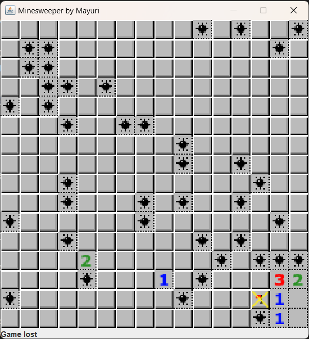
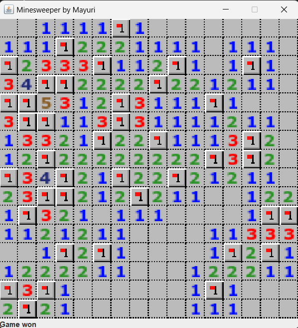

# Minesweeper Java

A simple Minesweeper game implemented in Java using Swing.

## Table of Contents

- [Description](#description)
- [Screenshots](#screenshots)
- [Features](#features)
- [How to Play](#how-to-play)
- [Installation](#installation)
- [Usage](#usage)

## Description

This project is a Minesweeper game implemented in Java. It features a graphical user interface built with Swing. The game follows the classic rules of Minesweeper, where the player must uncover cells on a grid to avoid hidden mines.

## Screenshots




## Features

- Classic Minesweeper gameplay.
- Adjustable grid size and number of mines.
- Win and lose conditions with appropriate messages.

## How to Play

1. Left-click to uncover a cell.
2. Right-click to flag a cell as a potential mine.
3. Avoid uncovering cells with mines.
4. Uncover all non-mine cells to win the game.

## Installation

Clone the repository to your local machine:

```bash
git clone https://github.com/mayurisampathgiri/MinesweeperClassic.git
```

##  Usage 

Compile and run the Minesweeper.java file using a Java development environment or command line.

```bash
javac Minesweeper.java
java Minesweeper
```
